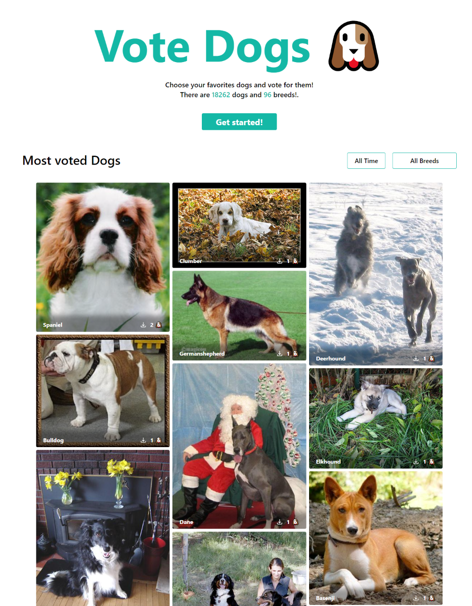

# Vote Dogs 🐶

Application to view and vote your favorite dogs. It is made in SvelteKit for Server Side Rendering and backend, MongoDB has database, Prisma has ORM, TypeScript and TailwindCSS to add styles quickly.



## Prerequisites

Install the dependencies.

```bash
pnpm install
```

Create an `.env` file and add the environment variables, see `.env.example`.

## Scripts

This creates a local server and rebuild it when you make changes.

```bash
pnpm run dev
```

This creates a production-ready version of the app and can be deployed to the web.

```bash
pnpm run build
```

This executes the available tests.

```bash
pnpm run test
```
